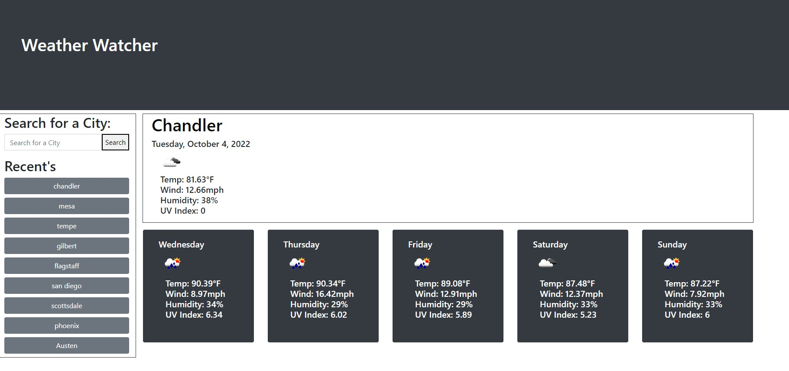

# weather-watcher
 
## Description
Weather dashboard that allows user to selected multiple cities and see the forecast. 
This allows user to have a saved list to click on and see the current weather along with 
the next five days. Motivation was to create a way to check weather in different cities 
and have those citys saved for easy access, especially while traveling.  

## Installation

No installation required, visit website:

## Usage

Type in a city in the US and select search. Doing this will pull up todays weather for that city as well as the next five days. If you plan on visiting more than one city, feel free to search the others as this will save a list of your recent searches. Those recent searches are also clickable and may be used to pull the weather up again without searching.

</img>

[Weather Watcher.webm](https://user-images.githubusercontent.com/112592440/193977693-a4c72533-bdc8-42ea-b909-e6b6373063ec.webm)

## Credits

Credits to bootstrap for layout designs:

<a href= "https://getbootstrap.com/" target="_blank">BootStrap</a>

## License

MIT License 

